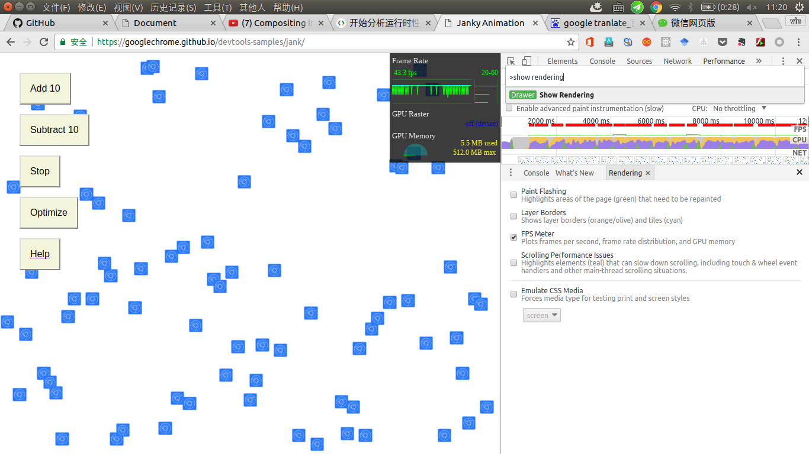
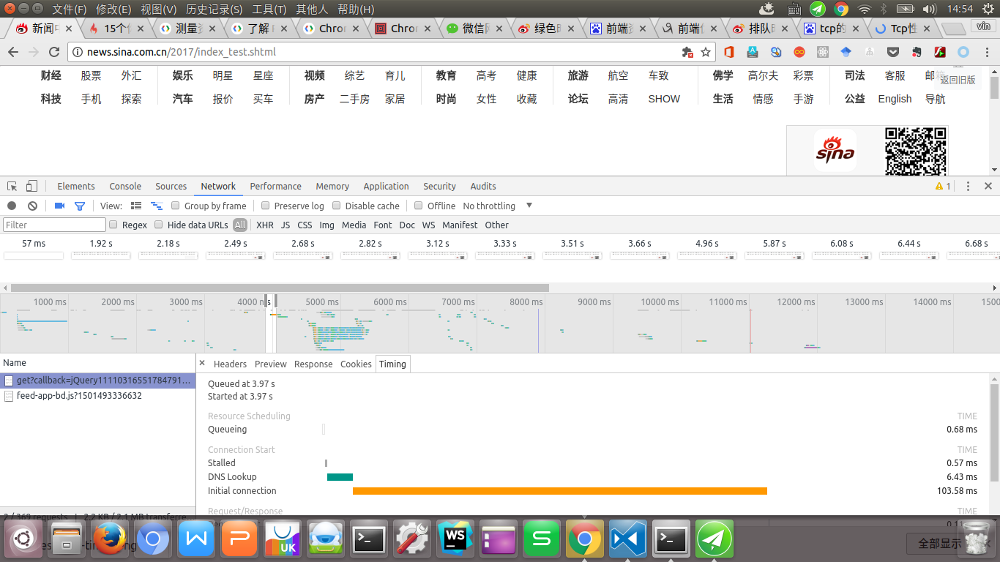

# Devtools
## 断点调试

断点调试的方法有多种，先介绍一下在js代码中打断点，
1. 打开 Sources 面板，从左侧的 File Navigator 窗格中选择脚本。
2. 如果处理压缩过的代码，请按 pretty print 按钮("{}")使代码可读。
3. 左侧点击添加和取消断点


## Performance

先介绍这上面的一行，分别是记录，刷新，清除，截屏，内存，调用gc
这里其实也是可以限制网络和cpu的性能的。

### fps面板

ctrl+shift+p然后输入命令"show rendering"
这时候可以选择FPS meter，然后界面中就会出现一个仪表板，显示网页实时的fps，内存占用的情况。测试动画的话还是挺好用的。


选中screenshot然后点击record，这时候就会记录界面中的截图，用鼠标hover上去，就能显示对应时间的界面，然后点击就可以显示对应的时间。

### performance中的network

之所以介绍这里面的network，是因为这上面会显示每一个资源的优先级。例如咱们的这个新首页，其中index.css是最高级，js文件是high，像一些图片啊什么的就是low了。


### Frames
frames上的绿色条纹，会显示对应时间的帧率。如果有动画效果，可以在这里面找到动画效果的帧率。


### Interactions

这个功能很明显就是处理用户交互的。里面有两个选择，一个是input，另一个是动画，input主要记录一些用户时间，例如mousemove，mousedown等。同一列的事件，通常是上面的事件触发了下方的事件。动画这一行会记录下事件的开始事件和结束时间。

### Main

同一列的事件，是上方时间触发了下方的时间，这个面板会将整个页面渲染的过程中所有步骤都显示出来，网络和html解析是蓝色的，JavaScript运行是黄色的，样式重新计算和布局是紫色的。绘画和合成是绿色的。点击某一个函数可以显示它的具体介绍，在call tree中会显示这整个函数执行的调用树。

像Gpu这些的，我也没什么可介绍的。


## 网络性能

下面是一个network的面板，大家应该很熟悉

我简单的说一下
这个实心灰点是记录按钮
旁边是清除按钮
摄像机按钮如果选中的话，是可以记录一部分网页的截图在下方显示
如果点击截图，会显示当前时间的所有network，双击显示大图
这个时间间隔的原理我没有找到资料，官网说的是增量图像。
可以在这一行的最右端选择模拟网络环境较差的移动端3g 2g等，也可以自定义网络限制
下面说一下这个Resource timing

### Filter的一些用法


Filter除了可以用匹配字符串匹配资源外
还可以通过一些关键词。但是我觉得可能实用性并没有那么强，下面是链接，感兴趣的话可以自己去看看

https://developers.google.com/web/tools/chrome-devtools/network-performance/resource-loading?utm_source=dcc&utm_medium=redirect&utm_campaign=2016q3#_5

### 自定义network面板 


可以通过右键点击，添加或者删除行列，实现定制化，比如查看gzip和cache这些的时候不需要每一个资源都打开查看了。

### Resource timing阶段

#### 重定向
立即开始 startTime。 
如果正在发生重定向，redirectStart 也会开始。
如果重定向在本阶段末发生，将采集 redirectEnd。
#### 应用缓存
如果是应用缓存在实现请求，将采集 fetchStart 时间。
#### DNS
domainLookupStart 时间在 DNS 请求开始时采集。
domainLookupEnd 时间在 DNS 请求结束时采集。
#### TCP
connectStart 在初始连接到服务器时采集。
如果正在使用 TLS 或 SSL，secureConnectionStart 将在握手（确保连接安全）开始时开始。
connectEnd 将在到服务器的连接完成时采集。
#### 请求
requestStart 会在对某个资源的请求被发送到服务器后立即采集。
响应
responseStart 是服务器初始响应请求的时间。
responseEnd 是请求结束并且数据完成检索的时间。


#### Queuing
如果某个请求正在排队，则指示：
请求已被渲染引擎推迟，因为该请求的优先级被视为低于关键资源（例如脚本/样式）的优先级。 图像经常发生这种情况。
请求已被暂停，以等待将要释放的不可用 TCP 套接字。
请求已被暂停，因为在 HTTP 1 上，浏览器仅允许每个源拥有六个 TCP 连接。
生成磁盘缓存条目所用的时间（通常非常迅速）
#### Stalled/Blocking
请求等待发送所用的时间。 可以是等待 Queueing 中介绍的任何一个原因。 此外，此时间包含代理协商所用的任何时间。
 Proxy Negotiation
与代理服务器连接协商所用的时间。
#### DNS Lookup
执行 DNS 查询所用的时间。 页面上的每一个新域都需要完整的往返才能执行 DNS 查询。
#### Initial Connection / Connecting
建立连接所用的时间，包括 TCP 握手/重试和协商 SSL 的时间。
#### SSL
完成 SSL 握手所用的时间。用于https协议
#### Request Sent / Sending
发出网络请求所用的时间。 通常不到一毫秒。
#### Waiting (TTFB)
等待初始响应所用的时间，也称为至第一字节的时间。 此时间将捕捉到服务器往返的延迟时间，以及等待服务器传送响应所用的时间。这就是等待服务器的相应时间。
#### Content Download / Downloading
接收响应数据所用的时间。

### 资源加载时间分析

#### dns时间
通常dns解析时间是不在考虑的范围里面的，但是在一些比较大的门户站点，比如新浪，尤其是一些没有开keep alive的服务器，dns解析的时间也挺长的，
下面这个dns的时间占比快一半了。

下面是dns预解析的步骤

1. 用meta信息来告知浏览器, 当前页面要做DNS预解析:
```
<meta http-equiv="x-dns-prefetch-control" content="on" />
```
2. 在页面header中使用link标签来强制对DNS预解析: 
```
<link rel="dns-prefetch" href="http://bdimg.share.baidu.com" />
```
在查找这个时候，我找到了另外两个比较有意思的预处理
预取和子资源，标有预取的资源被认为是低优先级，只有在当前页面加载完成后，才可能被浏览器下载。而资源资源一经遇到就会以高优先级获取，并且将与当前页面上的其余资源进行竞争，预取是HTML5规范的一部分，而今天由Firefox和Chrome支持，而子资源目前仅在Chrome中可用。
```
  <link rel="subresource" href="/javascript/myapp.js">
  <link rel="prefetch"    href="/images/big.jpeg">
```
#### tcp初始化连接时间

由于tcp协议的慢启动特性，如果每一个请求，都新建一个链接，三次握手和四次挥手的时间成本其实挺高的。例如下图

这个域名下的connection是close的，也就是请求之后，这个tcp链接就关闭了。如果后续还有其他请求，新建一个tcp连接的时间成本过高了。

#### 排队时间长


排队时间过长的话，是因为浏览器的设置每台主机最多同时六个tcp连接，这时候就需要域名分散，将资源分布到多个域名下，但是在http2.0中不需要这样做，在 HTTP 2 中，到服务器的单个 TCP 连接作为多路复用连接。这消除了 HTTP 1 中的六个连接限制，并且可以通过单个连接同时传输多个资源。

#### 绿色时间过长


原因一般有两个，一个是客户端到服务器的网络条件过差，另一个是因为服务器的处理速度过慢，在测试新首页改版的时候，经常会出现某一个很小的资源加载了几百ms的情况，这就是后台的处理资源的问题了。前者可以通过cdn在全国各地设立资源托管，后者，需要后端的一些优化，减少响应时间。

#### 蓝色时间过长

Content Download 阶段花费了大量时间，这时候可以通过gzip，雪碧图，图片处理压缩等方式，降低时间。
